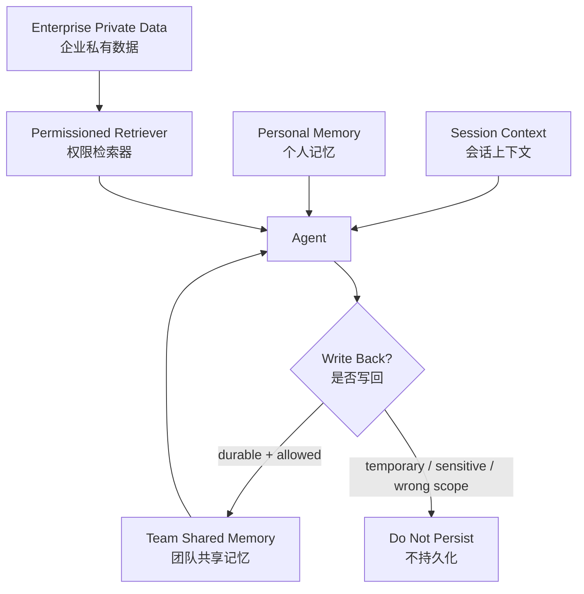
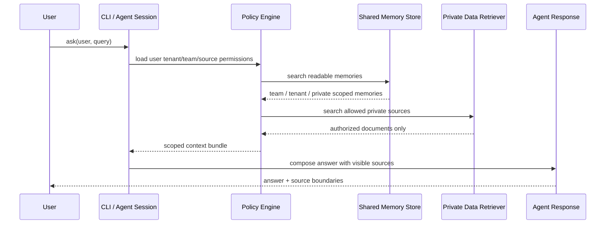
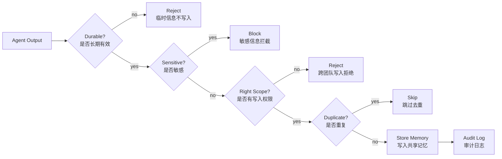

# Agent Shared Memory Demo

> 一个最小但能跑通的示例：Agent 如何在企业私有数据之上使用共享记忆，同时保留权限边界、写回策略、去重和审计。

这个项目不是一个生产级 RAG 框架，也不是又一个聊天机器人模板。它更像一张可以运行的架构草图，用尽量少的代码讲清楚企业 Agent 里一个经常被低估的问题：

**接入企业私有数据并不难，难的是让正确的记忆在正确的权限边界里持续存在。**

## 这个 Demo 想回答什么

很多 Agent 项目一开始会走得很快：接一个 LLM，接一个向量库，把内部文档灌进去，再加几个工具调用，看起来就已经能回答不少问题了。但一旦进入真实企业环境，问题会很快冒出来：

- 当前会话里的上下文，哪些应该被长期记住？
- 用户个人偏好，能不能变成团队共享知识？
- 财务、客服、产品的私有数据，谁能看，谁不能看？
- Agent 总结出来的内容，能不能自动写回知识库？
- 写错了怎么办，谁负责，能不能审计？

这个 Demo 用一个很小的 Python 项目把这些边界落下来。它没有引入外部依赖，也没有调用真实模型，原因很简单：这里要演示的重点不是模型能力，而是 Agent 进入企业之后最容易被忽略的状态和权限设计。

## 快速开始

```bash
python3 -m shared_memory_agent.seed
python3 -m shared_memory_agent.cli ask --user alice --query "How should we handle ACME onboarding?"
python3 -m shared_memory_agent.cli ask --user bob --query "Show finance renewal risk for ACME"
python3 -m shared_memory_agent.cli remember --user alice --team product --text "Remember this runbook: for ACME onboarding, always verify data residency before workspace provisioning."
python3 -m shared_memory_agent.cli ask --user alice --query "What should I remember for ACME onboarding?"
python3 -m unittest discover -s tests
```

运行后你会看到两个关键现象：

- `alice` 可以看到产品团队记忆和产品私有数据，但看不到财务私有数据。
- `bob` 可以看到财务续约风险，但看不到产品团队内部记忆。

这正是企业 Agent 应该具备的基本行为：它不是不知道更多信息，而是只能在当前用户权限内使用信息。

## 核心架构

这个 Demo 把 Agent 上下文拆成四层：



四层含义分别是：

| 层级 | 生命周期 | 典型内容 | 设计原则 |
| --- | --- | --- | --- |
| 会话上下文 | 当前任务内有效 | 当前问题、临时推理、工具输出 | 默认不持久化 |
| 个人记忆 | 跟随用户 | 偏好、常用项目、写作习惯 | 不默认共享 |
| 团队共享记忆 | 跟随团队或项目 | 决策、Runbook、协作约定 | 慎重写回，可审计 |
| 企业私有数据 | 跟随业务系统 | 文档、CRM、工单、财务记录 | 先鉴权，再检索 |

这里最重要的设计判断是：**企业私有数据不是共享记忆。**

私有数据可以被检索，可以参与某一轮回答，但它不应该因为被 Agent 读过就自动变成长期记忆。检索和写回是两件事，必须拆开。

## 请求流

一次查询的大致流程是：



这个流程里有一个原则：权限判断要发生在检索之前，而不是检索之后。真实系统里也一样，不应该先把所有候选文档捞出来，再在最后一层过滤。那样既容易泄漏，也很难审计。

## 写回流

很多 Agent 记忆系统真正危险的地方不是检索，而是写回。检索错了，通常是一轮回答错；写回错了，可能会污染后面很多轮任务。

本项目把写回设计成一条单独的策略链：



对应代码在 `shared_memory_agent/writeback.py`：

```python
def validate_writeback(user: User, team_id: str, text: str) -> tuple[bool, str]:
    if not can_write_team_memory(user, team_id):
        return False, "wrong_team_scope"
    return should_write_back(text)
```

这个策略很简单，但它表达了三个生产系统里很重要的判断：

- 不是所有回答都值得变成记忆。
- 不是所有用户都有权把内容写成团队记忆。
- 写入共享记忆必须能审计、能去重、能解释。

## Demo 用户

| 用户 | 团队 | 可访问数据源 | 用途 |
| --- | --- | --- | --- |
| `alice` | product | `public`, `product` | 产品侧客户交付流程 |
| `bob` | finance | `public`, `finance` | 财务续约和采购风险 |
| `cara` | support | `public`, `support` | 客服工单和升级处理 |

用户定义在 `shared_memory_agent/policy.py`：

```python
USERS: dict[str, User] = {
    "alice": User(
        user_id="alice",
        tenant_id="acme-corp",
        team_id="product",
        roles=("product_manager",),
        allowed_sources=("public", "product"),
    ),
}
```

## 项目结构

```text
agent-shared-memory-demo/
  shared_memory_agent/
    agent.py          # 组合记忆和私有数据，生成可解释回答
    cli.py            # 命令行入口
    memory_store.py   # SQLite 共享记忆和审计日志
    models.py         # User / Memory / PrivateDocument
    policy.py         # 用户、读权限、写权限
    private_data.py   # 模拟企业私有数据源
    seed.py           # 初始化 demo 数据
    writeback.py      # 写回策略
  tests/
    test_policy_and_memory.py
  docs/
    architecture.md
```

## 最佳实践映射

| 最佳实践 | Demo 位置 |
| --- | --- |
| 用 tenant / team / owner / visibility 给记忆分层 | `models.py`, `memory_store.py` |
| 先鉴权，再检索企业私有数据 | `policy.py`, `private_data.py` |
| 不把私有数据自动写成共享记忆 | `agent.py`, `writeback.py` |
| 写回前检查敏感内容和团队范围 | `writeback.py` |
| 共享记忆写入要去重 | `memory_store.py` |
| 共享记忆写入要留审计 | `memory_store.py` |
| 测试覆盖权限和写回边界 | `tests/test_policy_and_memory.py` |

## 为什么不用向量库和真实 LLM

这个 Demo 刻意没有引入向量库和真实 LLM。不是因为它们不重要，而是因为在企业 Agent 里，很多项目太早进入“模型和召回率优化”，反而绕开了更基础的问题：

- 信息能不能被这个用户看到？
- 这个信息能不能跨团队复用？
- 模型总结的内容能不能被持久化？
- 记忆变脏之后能不能追责和回滚？

等这些边界跑通之后，再把当前的简单检索替换成向量库、全文搜索、GraphRAG 或数据库查询，都比较自然。反过来，如果边界没设计好，一开始就接复杂检索栈，只会让问题更难定位。

## 可以怎么扩展到生产

这个项目可以按下面方向继续扩展：

- 把 `PRIVATE_DOCS` 替换成企业文档、CRM、工单系统或数据库连接。
- 把简单关键词检索替换成 BM25、向量检索或混合检索。
- 把 `USERS` 替换成企业 SSO / RBAC / ABAC 权限系统。
- 给共享记忆增加版本、过期时间、人工审核和回滚。
- 把审计日志接入企业 SIEM 或内部合规系统。
- 在 Agent 工具调用前后增加 policy hook，避免越权检索和越权写回。

## 设计判断

如果只保留一个观点，我会这样说：

**企业级 Agent 的上下文系统不应该只是一个更大的知识库，而应该是一套有权限、有生命周期、有写回策略的记忆系统。**

检索解决的是“现在知道什么”，记忆解决的是“以后还应该记得什么”。这两件事一旦混在一起，短期看起来会很智能，长期一定会变得难解释。

