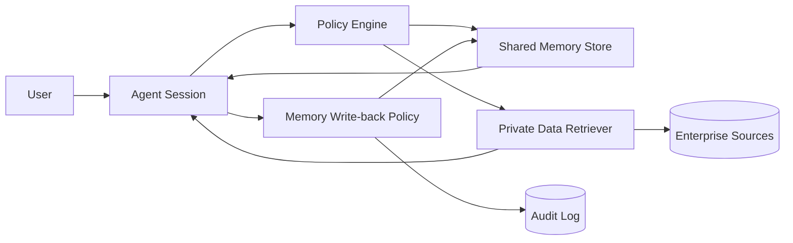

# Agent Shared Memory Demo

A small, runnable demo for combining agent shared memory with enterprise private data.

It demonstrates four ideas:

- short-term task context should not be treated as durable memory
- team memory should be explicitly scoped by tenant, team, and visibility
- private enterprise data should be retrieved under user permissions
- memory write-back needs policy, deduplication, and an audit trail

The demo intentionally uses Python standard library only. It is not a production RAG stack; it is a compact reference architecture for the article.

## Quick Start

```bash
python3 -m shared_memory_agent.seed
python3 -m shared_memory_agent.cli ask --user alice --query "How should we handle ACME onboarding?"
python3 -m shared_memory_agent.cli ask --user bob --query "Show finance renewal risk for ACME"
python3 -m shared_memory_agent.cli remember --user alice --team product --text "For ACME onboarding, always verify data residency before workspace provisioning."
python3 -m shared_memory_agent.cli ask --user alice --query "What should I remember for ACME onboarding?"
python3 -m unittest discover -s tests
```

## Architecture



## Demo Users

- `alice`: product team, can read product and public data
- `bob`: finance team, can read finance and public data
- `cara`: support team, can read support and public data

## Best Practice Mapping

| Practice | Where it appears |
| --- | --- |
| Scope memory by tenant/team | `shared_memory_agent/models.py`, `memory_store.py` |
| Enforce user permissions before retrieval | `policy.py`, `private_data.py` |
| Do not write every answer back to memory | `writeback.py` |
| Keep audit trail for memory writes | `memory_store.py` |
| Prefer explainable retrieval in demos | CLI result includes memory and private-data sources |

