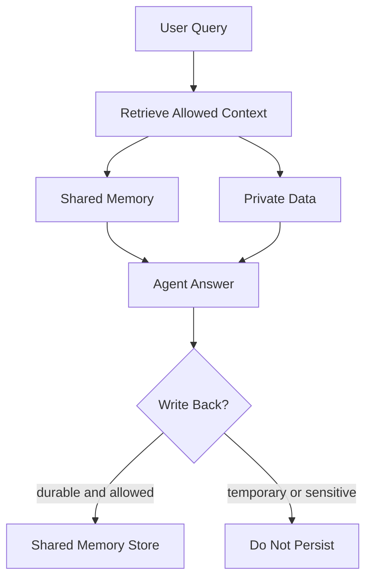

# Architecture Notes

This demo splits context into four layers:

1. Session context: the current task, not persisted by default.
2. Personal memory: user-specific habits and preferences. Not implemented here, but represented by `owner_id`.
3. Team shared memory: durable decisions and runbooks scoped by tenant and team.
4. Private enterprise data: source documents retrieved only after permission checks.

The important design choice is that private documents are not automatically converted into memory. Retrieval and write-back are separate decisions.

