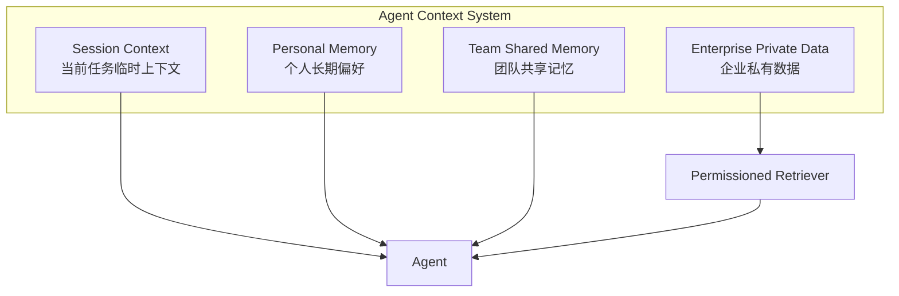
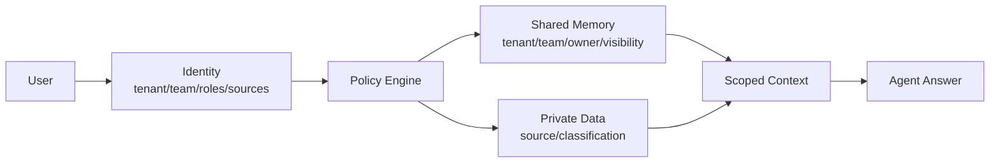
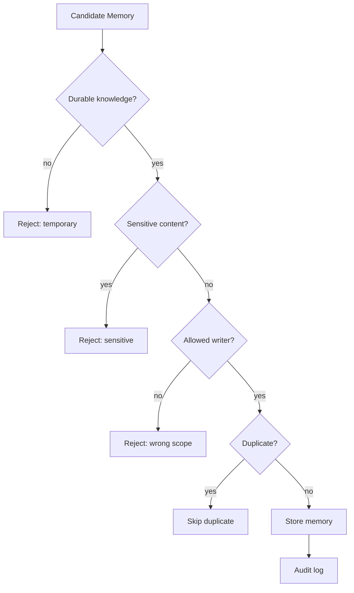

# 架构设计说明

这份文档补充 README 里的设计背景，重点解释为什么 demo 里要把记忆、私有数据、权限和写回拆开。

## 1. 四层上下文模型

四层拆开的原因：

- 会话上下文变化最快，默认不应该持久化。
- 个人记忆属于某个用户，不应该默认进入团队空间。
- 团队共享记忆是协作资产，需要审计和治理。
- 企业私有数据属于业务系统，检索和沉淀必须分开。

## 2. 权限模型

权限模型里有两个独立问题：

- 读权限：这个用户能不能读到某条记忆或某份私有数据。
- 写权限：这个用户能不能把某段内容沉淀到某个团队的共享记忆。

两者不能混用。能读某条信息，不代表能把它写成共享记忆。

## 3. 写回策略

写回策略的目标不是让 Agent 少记，而是让它只记值得复用、可解释、可追踪的内容。

生产系统里可以继续增加：

- 人工审核队列
- 记忆版本和回滚
- 过期时间和刷新策略
- 来源引用和证据链
- 敏感信息检测模型

## 4. Demo 与生产系统的差距

这个 demo 用 SQLite 和关键词检索，是为了让核心边界更明显。生产环境通常需要替换这些部分：

| Demo 组件 | 生产替换 |
| --- | --- |
| `USERS` 静态字典 | SSO / IAM / RBAC / ABAC |
| `PRIVATE_DOCS` 静态数据 | 文档库 / CRM / 工单 / 数据库 |
| 关键词搜索 | BM25 / 向量检索 / 混合检索 |
| SQLite | Postgres / Lakehouse / 记忆服务 |
| 简单敏感词 | DLP / 分类器 / 审核队列 |

但替换技术栈之前，建议先保留这几个接口边界：

- `can_read_memory`
- `can_read_document`
- `validate_writeback`
- `add_memory`
- `audit_log`

这些接口比具体检索技术更重要。
